# Лабораторная работа №2
## Стейкхолдеры и границы системы
### Информационная система медицинских организаций

---

## Задание №1: Анализ стейкхолдеров

| Стейкхолдер                              | Интерес к системе                                                          | Цели                                                                                | Влияние на проект                                                    | Возможные риски                                                                    |
| ---------------------------------------- | -------------------------------------------------------------------------- | ----------------------------------------------------------------------------------- | -------------------------------------------------------------------- | ---------------------------------------------------------------------------------- |
| **Главный врач / Администрация**         | Получение оперативной статистики, контроль загрузки, планирование ресурсов | Повышение эффективности работы учреждения, снижение издержек, выполнение отчётности | Высокое: утверждает ТЗ, выделяет бюджет, принимает финальное решение | Изменение требований в процессе разработки; недостаточное финансирование           |
| **Лечащие врачи и узкие специалисты**    | Удобный доступ к картам пациентов, историям болезней, результатам анализов | Экономия времени на документацию, быстрый доступ к данным, снижение ошибок          | Среднее: формируют требования к интерфейсу и функционалу             | Сопротивление внедрению из-за сложности интерфейса; неполное использование системы |
| **Заведующие отделениями**               | Контроль загрузки палат, распределение коек, мониторинг работы персонала   | Оптимизация коечного фонда, своевременная выписка/госпитализация                    | Среднее: участвуют в тестировании, корректируют бизнес-процессы      | Некорректное отражение реальных процессов в системе                                |
| **Регистратура поликлиники**             | Быстрая запись пациентов, ведение первичного учёта                         | Сокращение времени обслуживания, минимизация очередей                               | Низкое: конечные пользователи, предоставляют обратную связь          | Ошибки ввода данных из-за спешки или неудобного интерфейса                         |
| **Сотрудники лабораторий**               | Внесение результатов анализов, привязка к договорам                        | Автоматизация передачи результатов, исключение бумажного документооборота           | Низкое: предоставляют требования к форматам данных                   | Несовместимость форматов данных с внешними ЛИС                                     |
| **Пациенты**                             | Доступ к своей медицинской информации, удобство записи                     | Получение качественной и своевременной медицинской помощи                           | Низкое: косвенное влияние через обратную связь                       | Недовольство из-за сложностей с записью или доступом к данным                      |
| **ИТ-отдел / Системные администраторы**  | Стабильная работа системы, безопасность данных, масштабируемость           | Минимизация простоев, соответствие требованиям защиты информации                    | Высокое: отвечают за внедрение, поддержку и интеграцию               | Недостаточная квалификация для поддержки; уязвимости в безопасности                |
| **Внешние лаборатории**                  | Получение заказов на анализы, передача результатов                         | Автоматизация взаимодействия с медучреждениями                                      | Низкое: взаимодействуют через договоры и API                         | Нарушение сроков передачи данных; несовместимость протоколов                       |
| **Регуляторные органы (Минздрав, ФОМС)** | Соответствие системы законодательным требованиям, формирование отчётности  | Контроль качества медицинской помощи, прозрачность расходов                         | Высокое: устанавливают обязательные стандарты и форматы              | Изменения в законодательстве требуют доработки системы                             |

---

## Задание №2: Границы системы

### Что входит в систему:
- Учёт структуры медицинских учреждений (больницы → корпуса → отделения → палаты/кабинеты)
- Регистрация и управление данными о врачебном и обслуживающем персонале (с учётом специфических атрибутов по профилям)
- Поддержка совместительства и консультационной деятельности врачей
- Ведение персонифицированного учёта пациентов: амбулаторные и стационарные карты, история болезней, назначения, температурные листы
- Учёт проведённых операций (с исходами) для хирургов, стоматологов, гинекологов
- Маршрутизация пациентов: направление из поликлиники в больницу (прикреплённую или стороннюю)
- Интеграция с лабораториями: учёт договоров, профилей исследований, результатов анализов
- Формирование 14 типов отчётных запросов (кадры, загрузка коек, выработка врачей/лабораторий и др.)
- Разграничение прав доступа и аудит действий пользователей

### Что не входит в систему:
- Финансовый учёт и бухгалтерия (зарплата, закупки, смета)
- Управление медицинским оборудованием (техническое обслуживание, инвентаризация)
- Электронная запись пациентов через мобильные приложения или внешние порталы (может быть интеграция, но не ядро)
- Системы телемедицины и видеоконсультаций
- Хранение и обработка медицинских изображений (PACS-системы)
- Управление лекарственными складами и аптеками

### Внешние системы для взаимодействия:
| Внешняя система | Тип взаимодействия | Обмениваемые данные |
|-----------------|-------------------|---------------------|
| ЕГИСЗ / Федеральные реестры | Интеграция по API | Сведения о пациентах, врачах, медицинских организациях |
| Системы ОМС | Обмен файлами / API | Данные для страховых случаев, тарификация |
| Внешние лаборатории (ЛИС) | API / Файловый обмен | Направления на анализы, результаты исследований |
| Портал госуслуг / ЕПГУ | Авторизация / Уведомления | Запись на приём, уведомления пациентам |
| Системы электронной подписи | Интеграция по стандартам | Подписание медицинских документов |

### Процессы, подлежащие автоматизации:
1. Регистрация и обновление данных о пациентах и персонале
2. Назначение пациентов к врачам и распределение по палатам
3. Ведение электронных медицинских карт и историй болезни
4. Фиксация проведённых операций и их исходов
5. Формирование направлений в лаборатории и учёт результатов
6. Расчёт статистики: загрузка коек, выработка врачей, свободные места
7. Генерация отчётов по 14 типам запросов в реальном времени
8. Управление правами доступа и журналирование действий

---

## Задание №3: Контекстная диаграмма (DFD Level 0)

```mermaid
flowchart TD
    %% ==================== СТИЛИ ====================
    classDef system fill:#4A90E2,stroke:#2E5C8A,stroke-width:3px,color:white,font-weight:bold
    classDef actor fill:#F5F5F5,stroke:#666,stroke-width:2px,color:#333
    classDef flow stroke:#666,stroke-dasharray:0

    %% ==================== ЦЕНТРАЛЬНАЯ СИСТЕМА ====================
    System(("🏥 ИС МЕДИЦИНСКИХ ОРГАНИЗАЦИЙ")):::system

    %% ==================== ВНЕШНИЕ АКТОРЫ ====================
    Patient[👤 Пациент]:::actor
    Doctor[🩺 Врач / Медперсонал]:::actor
    Registration[📋 Регистратура поликлиники]:::actor
    HospitalAdmin[🏢 Администрация больницы]:::actor
    Laboratory[🔬 Лаборатория]:::actor
    ExternalMedOrg[🏥 Внешнее медучреждение]:::actor
    Regulatory[📑 Регуляторные органы / ОМС]:::actor

    %% ==================== ПОТОКИ ДАННЫХ: ПАЦИЕНТ ====================
    Patient -->|Личные данные, жалобы, запросы к карте| System
    System -->|Назначения, результаты анализов, выписки, уведомления| Patient

    %% ==================== ПОТОКИ ДАННЫХ: ВРАЧИ ====================
    Doctor -->|Диагнозы, назначения, данные об операциях, температурные листы| System
    System -->|История болезни пациента, результаты анализов, расписание, статистика| Doctor

    %% ==================== ПОТОКИ ДАННЫХ: РЕГИСТРАТУРА ====================
    Registration -->|Данные первичного приёма, запросы на запись| System
    System -->|Расписание врачей, список пациентов, статусы записей| Registration

    %% ==================== ПОТОКИ ДАННЫХ: АДМИНИСТРАЦИЯ ====================
    HospitalAdmin -->|Запросы отчётов, управление ресурсами, кадровые данные| System
    System -->|Статистика по койкам, выработке врачей, загрузке отделений| HospitalAdmin

    %% ==================== ПОТОКИ ДАННЫХ: ЛАБОРАТОРИЯ ====================
    Laboratory -->|Результаты анализов, профили исследований, договоры| System
    System -->|Направления на анализы, данные пациентов, договорная информация| Laboratory

    %% ==================== ПОТОКИ ДАННЫХ: ВНЕШНИЕ МЕДУЧРЕЖДЕНИЯ ====================
    ExternalMedOrg -->|Подтверждение приёма, данные о специализации| System
    System -->|Направления пациентов, запросы на госпитализацию| ExternalMedOrg

    %% ==================== ПОТОКИ ДАННЫХ: РЕГУЛЯТОРЫ ====================
    Regulatory -->|Требования к отчётности, нормативные форматы| System
    System -->|Статистические отчёты, данные для ОМС, кадровая отчётность| Regulatory

    %% ==================== ЛЕГЕНДА (опционально) ====================
    %% subgraph Legend ["📋 Легенда"]
    %%     direction LR
    %%     L1[<b>Сущности:</b>]:::actor
    %%     L2[<b>Система:</b>]:::system
    %%     L3[<b>→</b> Поток данных]
    %% end
```

![[vitaliy_lab2_dfd0.pdf]]
