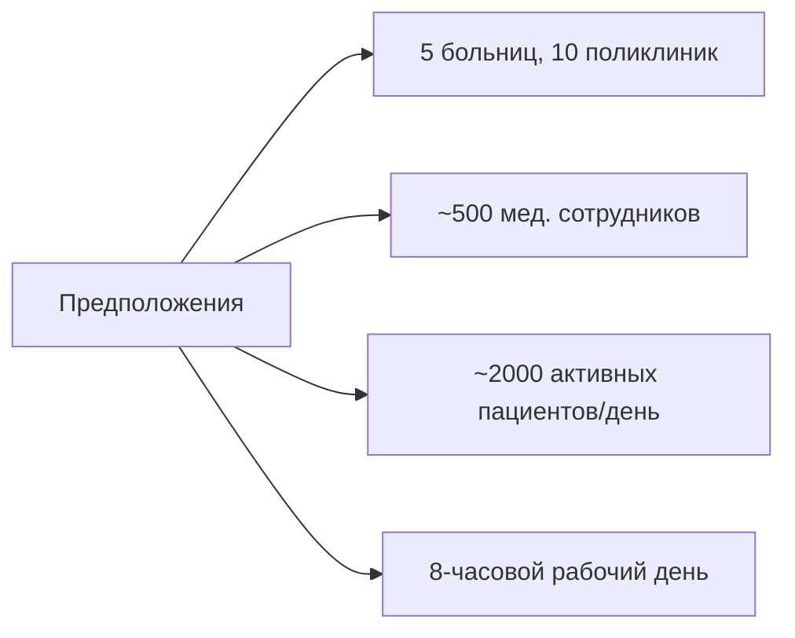

# Лабораторная работа №8
## Проектирование архитектуры информационной системы медицинских организаций

---

## Раздел 1 — Выбор архитектурного стиля

### Выбранный стиль: Клиент–сервер

### Верхнеуровневая схема системы

![[vitaliy_lab8_razd1.pdf]]

### Обоснование выбора

**Почему клиент-сервер подходит для этой задачи:**

1. **Централизованное управление данными**: Медицинские записи требуют строгой консистентности, резервного копирования и контроля доступа — всё это естественно реализуется на сервере.

2. **Множественные типы клиентов**: Система будет использоваться с рабочих станций в больницах, с мобильных устройств врачей на обходах, административными терминалами. Единый REST API позволяет обслуживать все типы клиентов без дублирования логики.

3. **Безопасность и аудит**: Все запросы проходят через сервер, где можно централизованно логировать доступ к медицинским данным (требование законодательства о защите персональных данных).

4. **Масштабируемость по мере роста**: При увеличении нагрузки можно горизонтально масштабировать API-серверы и добавить реплики БД, не переписывая архитектуру.

**Почему отказался от альтернатив:**

| Альтернатива                               | Причина отказа                                                                                                                                                                                |
| ------------------------------------------ | --------------------------------------------------------------------------------------------------------------------------------------------------------------------------------------------- |
| **Монолит (без разделения клиент/сервер)** | Не поддерживает мобильные клиенты без полной переделки; сложнее интегрировать внешние лабораторные системы; ограниченные возможности масштабирования отдельных функций (например, отчётность) |
| **Микросервисы**                           | Избыточная сложность для проекта: один разработчик, домен связный (управление одной организацией), распределённые транзакции для медицинских записей добавили бы рисков без реальной пользы   |

**Минусы выбора и стратегия работы с ними:**

| Минус | Как будем жить с этим |
|-------|----------------------|
| Единая точка отказа | Резервирование сервера, регулярные бэкапы БД, мониторинг здоровья системы |
| Версионирование API | С самого начала использовать версионированные эндпоинты (`/api/v1/...`) |
| Потенциальный бутылочный горлышко на БД | Использовать индексы, кэширование справочников, при росте — добавить read-реплики |

---

## Раздел 2 — Компоненты системы

### Детальная архитектурная схема

![[vitaliy_lab8_razd2.pdf]]

### Описание компонентов

| Компонент | Что делает | Почему нужен именно в этой системе |
|-----------|-----------|-----------------------------------|
| **Веб-интерфейс (React+TS)** | Предоставляет интерфейсы для приёма пациентов, ведения карт, формирования отчётов, выполнения 14 типов запросов | Медперсонал работает преимущественно с рабочих станций; компонентный подход React позволяет переиспользовать сложные формы (например, карточка пациента с историей) |
| **API Gateway** | Принимает все внешние запросы, проверяет SSL, распределяет нагрузку, применяет базовые лимиты | Единая точка входа упрощает безопасность (аудит доступа к медданным) и позволяет в будущем добавить новые клиенты без изменения бэкенда |
| **Auth Service** | Управляет аутентификацией, ролями (врач, медсестра, админ), правами доступа к данным | Критично для соблюдения врачебной тайны: медсестра не должна видеть все записи, врач — редактировать чужие назначения |
| **Patient Service** | Ведёт персонифицированный учёт пациентов, историю болезней, назначения, операции | Ядро системы: все 14 запросов так или иначе обращаются к данным пациентов |
| **Query Engine** | Реализует 14 типов аналитических запросов из ТЗ с фильтрацией по учреждению, профилю, периоду | Специфичная бизнес-логика медицинской аналитики вынесена в отдельный модуль для удобства тестирования и масштабирования |
| **Redis (кэш)** | Кэширует справочные данные: список специальностей, структура больниц, профили врачей | Справочники читаются часто, меняются редко; кэширование снижает нагрузку на БД и ускоряет отрисовку форм (важно при высокой загрузке регистратуры) |
| **PostgreSQL** | Хранит все реляционные данные: сотрудники, пациенты, палаты, назначения, результаты анализов | Требуются транзакции (например, при госпитализации: создать запись пациента + занять койку + назначить врача); сложные джойны для аналитических запросов |
| **MinIO (файловое хранилище)** | Хранит бинарные данные: рентген-снимки, сканы направлений, результаты лабораторных исследований | Хранение файлов в БД ухудшает производительность; объектное хранилище позволяет масштабировать отдельно и легко делать бэкапы |

---

## Раздел 3 — Оценка нагрузки (Back-of-the-Envelope)

### Исходные допущения (средний город, 5 больниц + 10 поликлиник)



### 1. Примерный DAU с разбивкой по ролям

| Роль                      | Всего пользователей | Активность            | DAU     |
| ------------------------- | ------------------- | --------------------- | ------- |
| Медперсонал               | 500                 | 90% активны в системе | 450     |
| Административный персонал | 50                  | ~100% в рабочие часы  | 50      |
| **Итого DAU**             |                     |                       | **500** |
### 2. Действия на пользователя в день (Read / Write раздельно)

| Роль              | Чтение (запросов/день)                                                                                       | Запись (запросов/день)                                                                                                            | Примеры операций                                 |
| ----------------- | ------------------------------------------------------------------------------------------------------------ | --------------------------------------------------------------------------------------------------------------------------------- | ------------------------------------------------ |
| Медперсонал       | 20 (просмотр карт, история, расписание, результаты анализов, списки пациентов, назначения, графики процедур) | 15 (назначения, обновления статуса, операции, направления, ввод показателей, обновление статуса, маркировка выполненных процедур) | Просмотр истории ≠ внесение нового диагноза      |
| **Администратор** | 10 (отчёты, справочники, статистика)                                                                         | 15 (регистрация пациентов, управление расписанием, договоры с лабораториями)                                                      | Создание договора = транзакция с валидацией прав |

Читать: (450×20 + 50×10) / 500 = 9,500 / 500 ≈ 19 read-запросов/пользователь
Писать: (450×15 + 50×15) / 500 = 7,500 / 500 ≈ 15 write-запросов/пользователь

### 3. RPS (Requests Per Second)

```
Read-запросы:  500 DAU × 19 = 9,500 запросов/день
Write-запросы: 500 DAU × 15 = 7,500 запросов/день

Активные секунды: 8 часов = 28,800 секунд
```

| Тип операции | Средний RPS                   | Пиковый RPS (×3) | Характер нагрузки                                  |
| ------------ | ----------------------------- | ---------------- | -------------------------------------------------- |
| **Read**     | 9,500 / 28,800 ≈ **0.33 RPS** | **~1.00 RPS**    | Лёгкие SELECT с фильтрами, часто покрываются кэшем |
| **Write**    | 7,500 / 28,800 ≈ **0.26 RPS** | **~0.78 RPS**    | Транзакции с валидацией, блокировками, аудитом     |
### 4. Объём данных (с разделением: чтение ≠ хранение)

> ⚠️ **Важно**: Данные, полученные в результате Read-запросов, **не хранятся** на сервере — они генерируются «на лету» из существующих записей. В расчёт объёма хранилища включаются **только** данные, созданные или изменённые операциями записи.

| Тип данных                                        | Размер одной операции     | Расчёт          | Итого/день   | Итого/год                   |
| ------------------------------------------------- | ------------------------- | --------------- | ------------ | --------------------------- |
| **Read-ответ** (не хранится!)                     | ~3 КБ (сжатый JSON)       | 9,500 × 3 КБ    | ~30 МБ/день  | **0 ГБ** (не накапливается) |
| **Write-запрос** (новые/изменённые данные)        | ~5 КБ (тело + метаданные) | 7,500 × 5 КБ    | ~40 МБ/день  | ~8.75 ГБ                    |
| **Аудит-лог** (требование законодательства)       | ~2 КБ на запись           | 7,500 × 2 КБ    | ~15 МБ/день  | ~3.5 ГБ                     |
| **Медицинские файлы** (рентген, сканы — отдельно) | ~50 МБ/пациент в среднем  | ~50 файлов/день | ~2.5 ГБ/день | ~625 ГБ/год                 |

```
Текстовые данные + аудит:  8.75 + 3.5 = ~12.25 ГБ/год
Медицинские изображения:                    ~625 ГБ/год
─────────────────────────────────────────────────────
Всего с запасом (индексы, бэкапы, рост):   ~700 ГБ/год
```

### 5. Вывод о масштабировании

![[vitaliy_lab8_razd4.pdf]]

**Итоговый ответ:** 
На текущем этапе **горизонтальное масштабирование не требуется**. Достаточно одного хорошо сконфигурированного сервера с репликацией БД для отказоустойчивости. Инвестиции следует направить на обеспечение целостности данных, резервное копирование и безопасность, а не на инфраструктурную сложность.


---

## Раздел 4 — Выбор стека технологий

| Слой | Выбор | Обоснование | Рассмотренная альтернатива и причина отказа |
|------|-------|-------------|-------------------------------------------|
| **Бэкенд** | Python + FastAPI | • Pydantic обеспечивает строгую валидацию медицинских данных (критично для безопасности)<br/>• Автоматическая генерация OpenAPI-документации упрощает интеграцию с внешними лабораториями<br/>• Async-поддержка эффективна для I/O-операций (запросы к БД, файлам)<br/>• Богатая экосистема для аналитики (pandas) при необходимости отчётности | **Django** — слишком "тяжёлый" для API-ориентированной системы, много "лишней" функциональности; **Node.js+Express** — менее строгая типизация, выше риск ошибок в критичной медицинской логике |
| **База данных** | PostgreSQL | • Полная поддержка ACID — обязательно для транзакций (госпитализация = запись пациента + бронь койки + назначение врача)<br/>• JSONB позволяет хранить гибкие мед. данные (разные специальности — разные поля) без потери реляционной целостности<br/>• Full-text search упрощает поиск по истории болезней | **MySQL** — хорошая СУБД, но менее продвинутая работа с JSON и аналитическими запросами; **MongoDB** — schema-less привлекателен, но потеря связей "пациент-врач-отделение" недопустима в медицине |
| **Фронтенд** | React + TypeScript | • Компонентная архитектура идеальна для переиспользуемых элементов (карточка пациента, форма назначения)<br/>• TypeScript снижает количество ошибок в сложных формах (валидация до отправки на сервер)<br/>• Экосистема готовых медицинских UI-компонентов (например, для графиков температуры) | **Vue.js** — проще в освоении, но меньше корпоративных решений для сложных форм; **Angular** — избыточен по весу и сложности для данного проекта |
| **Кэш** | Redis | • In-memory хранение справочников (списки специальностей, структура учреждений) сокращает время отклика форм на 50-100 мс — важно при потоковом приёме пациентов<br/>• Поддержка TTL автоматически инвалидирует кэш при изменении данных | **Memcached** — выполняет базовое кэширование, но отсутствуют продвинутые структуры данных (sorted sets) на случай будущего расширения (например, рейтинг врачей по загрузке) |

---

## Раздел 5 — Архитектура кода (бэкенд)

### Слоистая архитектура

![[vitaliy_lab8_razd5.pdf]]

### Описание слоёв

| Слой           | Ответственность                                                                                                                                                                                                                                                  | Примеры модулей для медицинской системы                                                                                                                                                                      |
| -------------- | ---------------------------------------------------------------------------------------------------------------------------------------------------------------------------------------------------------------------------------------------------------------- | ------------------------------------------------------------------------------------------------------------------------------------------------------------------------------------------------------------ |
| **Controller** | • Парсинг HTTP-запросов и параметров<br/>• Валидация входных данных через Pydantic-модели<br/>• Проверка прав доступа (роль пользователя)<br/>• Формирование стандартных ответов (успех/ошибка)                                                                  | `auth_controller` (вход, получение токена), `patient_controller` (CRUD пациентов), `query_controller` (обработка 14 типов аналитических запросов)                                                            |
| **Service**    | • Реализация бизнес-правил предметной области:<br/>  - Можно ли госпитализировать пациента в это отделение?<br/>  - Как рассчитать загрузку врача?<br/>  - Какие фильтры применить для запроса №3?<br/>• Координация нескольких репозиториев в рамках транзакции | `patient_service` (логика приёма/выписки), `staff_service` (расчёт коэффициентов, отпусков), `query_engine` (исполнение аналитических запросов), `lab_integration_service` (работа с договорами лабораторий) |
| **Repository** | • Преобразование доменных моделей в запросы к БД (SQLAlchemy ORM)<br/>• Оптимизация запросов (eager loading, индексы)<br/>• Абстрагирование схемы БД от бизнес-логики                                                                                            | `hospital_repo` (структура корпусов/отделений), `medical_record_repo` (история болезней с фильтрами), `operation_repo` (учёт хирургических вмешательств)                                                     |
| **Model**      | • Описание сущностей предметной области с валидацией:<br/>  - Doctor: specialty, academic_degree, operations_count<br/>  - Patient: diagnosis_history, current_ward, attending_physician<br/>• Инкапсуляция правил целостности данных                            | `doctor.py`, `patient.py`, `hospital_structure.py`, `medical_encounters.py`                                                                                                                                  |

