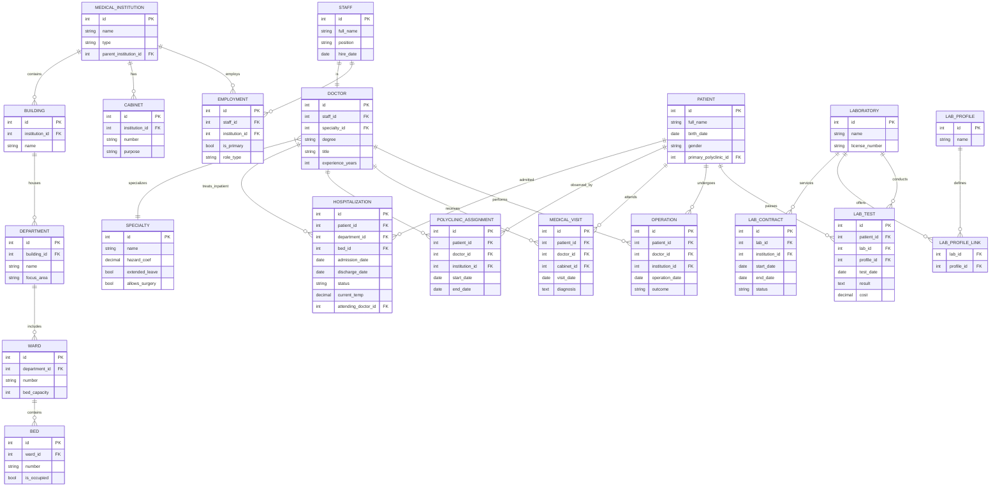

# Лабораторная работа №7. Проектирование логической модели базы данных для медицинских организаций

📌 **Обоснование (связь с ЛР1–ЛР6)**
Проектирование выполнено на основе результатов предыдущих этапов:

```
ЛР1: Что делает система? → Бизнес-процессы
     ↓
ЛР2: Кто участвует? → Роли и границы
     ↓
ЛР3–4: Как движутся данные? → Потоки и хранилища
     ↓
ЛР5: Как система должна работать в идеале? → Сценарии TO-BE
     ↓
ЛР6: Какие правила нельзя нарушать? → Ограничения и валидации
     ↓
ЛР7: Как это хранить надёжно и эффективно? → Логическая модель БД (3НФ)
```

**Шаг 1. Выделение основных хранимых сущностей**
На основе анализа предметной области и функциональных требований выделены следующие сущности:

`MedicalInstitution` (Медицинское учреждение)
`Building` (Корпус)
`Department` (Отделение)
`Ward` (Палата)
`Bed` (Койка)
`Cabinet` (Кабинет)
`Staff` (Сотрудник)
`Specialty` (Специализация)
`Doctor` (Врач)
`Employment` (Трудовое назначение)
`Patient` (Пациент)
`Hospitalization` (Стационарное лечение)
`PolyclinicAssignment` (Амбулаторное наблюдение)
`MedicalVisit` (Амбулаторный прием)
`Operation` (Операция)
`Laboratory` (Лаборатория)
`LabProfile` (Профиль лаборатории)
`LabContract` (Договор лаборатории)
`LabTest` (Лабораторное исследование)

**Шаг 2. Атрибуты, ключи, типы данных (абстрактно)**

| Сущность | Атрибуты | Ключ | Типы данных (абстрактно) |
|---|---|---|---|
| `MedicalInstitution` | id, name, type, parent_institution_id | PK: id | INT, VARCHAR(150), ENUM, INT(FK) |
| `Building` | id, institution_id, name | PK: id | INT, INT(FK), VARCHAR(100) |
| `Department` | id, building_id, name, focus_area | PK: id | INT, INT(FK), VARCHAR(100), VARCHAR(150) |
| `Ward` | id, department_id, number, bed_capacity | PK: id | INT, INT(FK), VARCHAR(20), INT |
| `Bed` | id, ward_id, number, is_occupied | PK: id | INT, INT(FK), VARCHAR(10), BOOL |
| `Cabinet` | id, institution_id, number, purpose | PK: id | INT, INT(FK), VARCHAR(20), VARCHAR(100) |
| `Staff` | id, full_name, position, hire_date, contact | PK: id | INT, VARCHAR(200), ENUM, DATE, VARCHAR(50) |
| `Specialty` | id, name, hazard_coef, extended_leave, allows_surgery | PK: id | INT, VARCHAR(100), DECIMAL, BOOL, BOOL |
| `Doctor` | id, staff_id, specialty_id, degree, title, experience_years | PK: id | INT, INT(FK,UNQ), INT(FK), ENUM, ENUM, INT |
| `Employment` | id, staff_id, institution_id, is_primary, role_type | PK: id | INT, INT(FK), INT(FK), BOOL, ENUM |
| `Patient` | id, full_name, birth_date, gender, primary_polyclinic_id | PK: id | INT, VARCHAR(200), DATE, ENUM, INT(FK) |
| `Hospitalization` | id, patient_id, department_id, bed_id, admission_date, discharge_date, status, current_temp, attending_doctor_id | PK: id | INT, INT(FK), INT(FK), INT(FK), DATE, DATE, ENUM, DECIMAL, INT(FK) |
| `PolyclinicAssignment` | id, patient_id, doctor_id, institution_id, start_date, end_date | PK: id | INT, INT(FK), INT(FK), INT(FK), DATE, DATE |
| `MedicalVisit` | id, patient_id, doctor_id, cabinet_id, visit_date, diagnosis | PK: id | INT, INT(FK), INT(FK), INT(FK), DATE, TEXT |
| `Operation` | id, patient_id, doctor_id, institution_id, operation_date, outcome | PK: id | INT, INT(FK), INT(FK), INT(FK), DATE, ENUM |
| `Laboratory` | id, name, license_number | PK: id | INT, VARCHAR(150), VARCHAR(50) |
| `LabProfile` | id, name | PK: id | INT, VARCHAR(100) |
| `LabContract` | id, lab_id, institution_id, start_date, end_date, status | PK: id | INT, INT(FK), INT(FK), DATE, DATE, ENUM |
| `LabTest` | id, patient_id, lab_id, profile_id, test_date, result, cost | PK: id | INT, INT(FK), INT(FK), INT(FK), DATE, TEXT, DECIMAL |

**Шаг 3. Связи между сущностями и промежуточные таблицы**

| Связь                                                           | Тип          | Обоснование                                                                                     |
| --------------------------------------------------------------- | ------------ | ----------------------------------------------------------------------------------------------- |
| `MedicalInstitution` ↔ `Building`                               | 1 : M        | Учреждение может содержать несколько корпусов.                                                  |
| `Building` ↔ `Department`                                       | 1 : M        | В корпусе размещается одно или несколько отделений.                                             |
| `Department` ↔ `Ward`                                           | 1 : M        | Отделение состоит из палат.                                                                     |
| `Ward` ↔ `Bed`                                                  | 1 : M        | В палате фиксированное количество коек.                                                         |
| `MedicalInstitution` ↔ `Cabinet`                                | 1 : M        | Поликлиники/больницы имеют кабинеты для приема.                                                 |
| `Staff` ↔ `Doctor`                                              | 1 : 1 (0..1) | Врач является подвидом сотрудника. Атрибуты разделены для соблюдения 3НФ.                       |
| `Specialty` ↔ `Doctor`                                          | 1 : M        | Один профиль может быть у многих врачей.                                                        |
| `Staff` ↔ `Institution` через `Employment`                      | M : M        | Врач/персонал может работать в нескольких учреждениях (основное/совместительство/консультация). |
| `Patient` ↔ `Department`/`Bed`/`Doctor` (via `Hospitalization`) | M : 1        | Пациент в стационаре имеет 1 лечащего врача и закреплен за 1 койкой в отделении.                |
| `Patient` ↔ `Doctor` через `PolyclinicAssignment`               | M : M        | В поликлинике пациент наблюдается у нескольких врачей.                                          |
| `Patient` ↔ `Doctor`/`Cabinet` через `MedicalVisit`             | M : M        | Учет амбулаторных посещений для расчета выработки.                                              |
| `Laboratory` ↔ `Institution` через `LabContract`                | M : M        | Лаборатория обслуживает учреждения по договору.                                                 |
| `Laboratory` ↔ `LabProfile` через `Lab_Profile_Link`            | M : M        | Лаборатория имеет один или несколько профилей исследований.                                     |
| `Patient` ↔ `LabTest`/`Operation`                               | 1 : M        | У пациента может быть много анализов и операций в истории.                                      |

Промежуточные таблицы (`Employment`, `Hospitalization`, `PolyclinicAssignment`, `LabContract`, `Lab_Profile_Link`) являются ассоциативными. Они реализуют отношения «многие-ко-многим» и несут собственные атрибуты (даты, роли, статусы, номера коек), что полностью соответствует требованиям 3НФ.

🔹 **Шаг 4. Ограничения и целостность (PK / FK, UNIQUE, NOT NULL, CHECK)**

| Ограничение | Поле/Таблица | Описание |
|---|---|---|
| PRIMARY KEY | Все `*_id` | Гарантирует уникальную идентификацию записей. |
| FOREIGN KEY | Все `*_id(FK)` | Обеспечивает ссылочную целостность (`ON DELETE RESTRICT` для основных справочников, `ON DELETE CASCADE` для журналов посещений/анализов). |
| NOT NULL | `name`, `hire_date`, `birth_date`, `admission_date`, `test_date` | Критичные данные, без которых запись не имеет смысла. |
| UNIQUE | `Employment(staff_id, institution_id)`, `Doctor(staff_id)`, `Bed(number, ward_id)` | Исключает двойное трудоустройство в одном учреждении и дублирование номеров коек/врачей. |
| UNIQUE | `PolyclinicAssignment(patient_id, doctor_id, institution_id)` (при `end_date IS NULL`) | Гарантирует одно активное наблюдение у врача в одной поликлинике. |
| CHECK (логическое) | `MedicalInstitution.type` | Значения строго `'Hospital'` или `'Polyclinic'`. |
| CHECK (логическое) | `Doctor.degree` ↔ `Doctor.title` | `IF degree = 'Doctor' THEN title CAN BE 'Professor'`. Реализуется через триггер или приложение. |
| CHECK (логическое) | `Employment.role_type` ↔ `Doctor.title` | Если `role_type = 'Consulting'`, то `title` должен быть `'Professor'` или `'Docent'`. Ограничивает множественные консультации только для ученых степеней. |
| CHECK (логическое) | `Bed.is_occupied` | Автоматически переключается при вставке/выписке из `Hospitalization` (через триггер). |
| DEFAULT | `Bed.is_occupied = FALSE`, `Hospitalization.status = 'Active'` | Упрощает ввод и отражает текущее состояние. |

📊 **Результат 1. ER-диаграмма**



![[vitaliy_lab7.pdf]]

📝 **Результат 2. Текстовое описание проектирования БД**

**1. Обоснование выбора сущностей и нормализации до 3НФ**
Проектирование выполнено с строгим соблюдением принципов реляционной нормализации:
- **1НФ (Атомарность)**: Все составные атрибуты разбиты на неделимые поля. Например, ФИО, даты, статусы вынесены отдельно. Специфические характеристики врачей (коэффициент за вредность, отпуск) вынесены в `Specialty`, а не дублируются в каждой карточке врача. Множественные места работы разделены в таблицу `Employment`.
- **2НФ (Отсутствие частичных зависимостей)**: В ассоциативных таблицах (`Employment`, `Hospitalization`, `LabContract`, `PolyclinicAssignment`) все неключевые атрибуты зависят от полного составного ключа. Например, статус занятости койки зависит от связки `patient_id + bed_id + admission_date`, а не от подмножества полей.
- **3НФ (Отсутствие транзитивных зависимостей)**: Неключевые атрибуты зависят только от первичного ключа. Название учреждения, адрес корпуса, профиль отделения хранятся в своих таблицах. Данные о степени, звании и опыте привязаны строго к `Doctor`. Связи реализованы через FK, что полностью исключает избыточность и аномалии обновления/удаления. Расчетные метрики (число операций, средняя выработка) не хранятся, а вычисляются динамически через `JOIN` и агрегатные функции.

**2. Обеспечение целостности и бизнес-правил**
- **Ссылочная целостность**: Реализована через `FOREIGN KEY`. Удаление справочников (`Specialty`, `Laboratory`, `Building`) ограничено (`RESTRICT`), пока существуют зависимые записи. Журналы посещений и анализов каскадно удаляются или помечаются архивными.
- **Доменная целостность**: Использованы `ENUM` для типов учреждений, должностей, степеней, исходов операций. Это исключает ввод некорректных значений.
- **Сложные бизнес-правила**:
  - Правило совместительства: `CHECK` на `Employment` разрешает максимум 2 основные записи (`is_primary = TRUE`) на сотрудника, но не ограничивает `role_type = 'Consulting'` для профессоров/доцентов.
  - Специфика профилей: `Specialty.allows_surgery` контролирует доступ к таблице `Operation`. `hazard_coef` и `extended_leave` применяются при расчете зарплат и отпусков на уровне бизнес-логики.
  - Учет коек: Триггер на `Hospitalization` автоматически меняет `Bed.is_occupied`. Запрос на свободные койки выполняется через `JOIN Ward + Bed WHERE is_occupied = FALSE`.
  - Прикрепление поликлиник: `MedicalInstitution.parent_institution_id` реализует иерархию. При направлении пациента из поликлиники система проверяет наличие договора или совместимость профилей.

**3. Поддержка функциональных требований (14 запросов)**
Схема полностью покрывает требования ТЗ:
- **Запросы 1–5**: Списки врачей/персонала фильтруются через `JOIN Staff`, `Employment`, `Doctor`, `Specialty` и агрегаты по `Operation`/`MedicalVisit`. Степени и звания выбираются напрямую из `Doctor`.
- **Запрос 6**: Пациенты стационара выбираются из `Hospitalization` с `JOIN` на `Ward`, `Department`, `Bed`, `Doctor` (по `attending_doctor_id`).
- **Запросы 7, 13**: История стационарного лечения и операций извлекается из `Hospitalization` и `Operation` с фильтрацией по датам и врачам.
- **Запрос 8**: Амбулаторные пациенты врача выбираются через `PolyclinicAssignment` и `MedicalVisit`.
- **Запросы 9–10**: Учет палат/коек через `Ward` + `Bed`. Учет кабинетов и посещений через `Cabinet` + `MedicalVisit` (COUNT + GROUP BY).
- **Запросы 11–12**: Выработка рассчитывается как `COUNT(MedicalVisit.visit_date) / DATEDIFF` для амбулатории и `COUNT(Hospitalization) WHERE status='Active'` для стационара.
- **Запрос 14**: Загрузка лаборатории вычисляется по `LabTest` (`COUNT / период`). Все выборки эффективны благодаря индексам по FK и составным уникальным ограничениям.

**4. Итог**
Логическая модель базы данных приведена к 3НФ, гарантирует ссылочную и доменную целостность, поддерживает все 14 видов запросов из технического задания и готова к переходу на этап физической реализации (создание таблиц в PostgreSQL/MySQL, настройка индексов, представлений (VIEW) для отчетов, ролевой модели доступа). Архитектура масштабируема, позволяет легко добавлять новые профили исследований, типы персонала и филиалы без изменения схемы ядра.